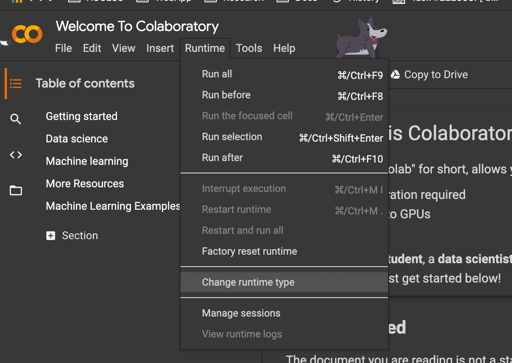

# Google Colaboratory の使い方
---

## Colaboratory とは

- [Colaboratory](https://colab.research.google.com/) （略して「Colab」）は、Google Researchの製品
- ブラウザ上で任意のPythonコードを書いて実行することができる
- 特に機械学習、データ分析、教育などに適している
- GPUを含むコンピューティングリソースへの無料アクセスを提供
- セットアップを必要としないJupyterノートブックのホスティングサービス

参考: [Colaboratory – Google](https://research.google.com/colaboratory/faq.html)

---

## 注意事項

- リソースの制限がある
- 実行時間の上限は 12 時間
- しばらく操作がない場合もセッションが切れる
- 割り当てられるメモリのサイズや CPU, GPU の種類は時と場合による（メモリ不足でエラーになる場合はセッションを再起動することで、より大きなリソースが割り当てられる場合もある）
- GPU/TPU を使い過ぎると一時的に GPU/TPU の利用ができなくなる場合がある
- 主に割り当てられる GPU は下記

> The GPUs available in Colab often include Nvidia K80s, T4s, P4s and P100s.

参考: [Colaboratory – Google](https://research.google.com/colaboratory/faq.html)

---

## セッションで GPU を有効にする方法

Runtime --> Change runtime type



---

## セッションの管理方法

不要なセッションの停止

Runtime --> Manage Sessions --> Terminate

---

## ライブラリ等を追加する場合

セルで ! の後に shell のコマンドを記載して実行可能です。

```
!pip install foo
```

もしくは下記のようにすることで、shell を複数行に渡って記述できます。

```
%%shell
pip install foo
wget https://example.com/bar
```

---

## Google Drive をマウントする方法

Google drive アイコンをクリックするだけ（ただし private notebook のみ）

> Colab integration with Google Drive just got better. Authenticate only once per notebook. No authentication codes are necessary for private notebooks when using the 'Mount Drive' button in the file browser.

https://twitter.com/GoogleColab/status/1226929213560610818

下記を入力してセルを実行することでもマウント可能です。

```
from google.colab import drive
drive.mount('/content/drive')
```

Google drive へのアクセスを許可するための認証の手順が表示されるので、それに従ってください。

---

## その他 tips

- Shift + Enter で現在のセルを実行できます

---

Let’s get started!

[Google Colaboratory](https://colab.research.google.com/)
